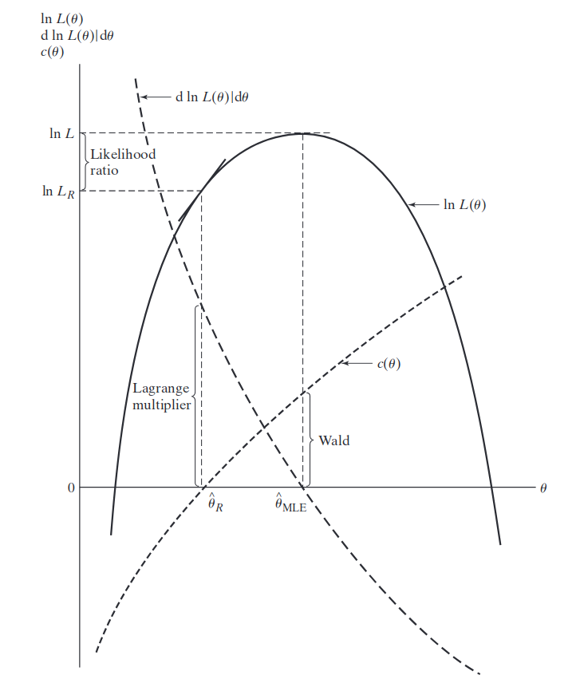

# Econometrics  OLS textbook

### Claim 16
$s^2=(n-k)^{-1} \hat{\epsilon}^\intercal\epsilon$ is the unbiased estimator of $\sigma^2$.And theproof is written on textbook.

$trace(X(X^\intercal X)^{-1})X^\intercal)=trace((X^\intercal X)^{-1})XX^\intercal)=K$ <!--it's on footer lol-->

### Claim 17
gives a way to estimate $\hat{Var}(\hat{\beta})$

### Claim 18
$\hat{\beta}-\beta=(X^\intercal X)^{-1})X\epsilon=A\epsilon\sim N(A\Sigma A^\intercal)$ because $A\epsilon$ is the linear combination of $\epsilon$.

as for $(n-K)\frac{s^2}{\sigma^2}$, from [Green2007](M has to be an idenpotent matrix),we know that it follows the distribution.

for independece, they both follow normal distribution, so linear independence(showed in textbook) totally equals to independence.

## 2.4

$R^2=\frac{ESS}{TSS}=1-\frac{RSS}{TSS}=1-\frac{\hat{\epsilon}^\intercal\epsilon}{y^\intercal M_0y}$ and $M_0=I_n-ll^\intercal/n$ where $ll^\intercal$ is a matrix full of 1, this is the matrix form of deaveraged y.

the adjusted $R^2$ will weaken the effect of adding explaining variables, concentrating on model.

### Information Criterion

SIC and AIC

# OLS test
## 2.4 Constrained Least Squares

Uniside test is more likely to be signifigant Multiside test.

## 2.3.3 J Linear Restrictions (F/Wald Test)
should notice that F is better in small amount samples, with bigger observation, Wald could be as good.
discrepancy: difference

### Wald Test
$H_0:R\beta=c$ then $R(\hat{\beta}-\beta)$~$N(0,R\sigma^2(X^\intercal X)^{-1}R^\intercal)$

$R\hat{\beta}-c\sim N(0,R\sigma^2(X^\intercal X)^{-1}R^\intercal)$

according to [Green2012] $(\sigma^2)^{-1}(R\hat{\beta}-c)^\intercal (R(X^\intercal X)^{-1}R^\intercal)^{-1}(R\hat{\beta}-c)\sim{\chi}^2_{j}$

$(n-K)\frac{s^2}{\sigma^2}\sim \chi^2_{(n-K)}$

so the dividend follows the F-distribution.

## Non-Spherical Disturbances
- (A5**) 
- Example1 : Heteroskedasticity
- Example2 : Serial Correlation
- Example3 : Panel Data with Random Effect
   $P(X)=X^\intercal(X^\intercal X)^{-1}X$
   $P(I_n \bigotimes l_Tl_T)$
   $M(I_n \bigotimes l_Tl_T)=I_{nT}- P(I_n \bigotimes l_Tl_T)$
## GLS
$\Omega^{-1}=C\Lambda^{-1}C^\intercal$
$=C\Lambda^{-0.5}\Lambda^{-0.5}C^\intercal$=
$P^\intercal P, and\   \Omega =(P^\intercal P)^{-1}$
$Py=P\beta X+P\epsilon$
$E(\epsilon^*)=E(P\epsilon)=PE(\epsilon)$
$y^*=X^*\beta+\epsilon^*$
so $\hat{\beta}_{GLS}=({X^*}^\intercal X^*)^{-1}{X^*}^{\intercal}y^*,var(\hat{\beta}_{GLS})=\sigma^2(X^\intercal\Omega^{-1}X)^{-1}$
### Feasible GLS 
unknown $\Omega$, usually use $\hat{\Omega}\;instead.$

## MLE
Maximum Likelihood Estimation
Should assumpt the distribution first.
$L(\beta,\sigma^2)=-\frac{n}{2}\pi-\frac{n}{2}ln\sigma^2-\frac{1}{2}ln|\Omega|-\frac{1}{2}(y-{X\beta}_{MLE})^\intercal\Omega^{-1}(y-{X\beta}_{MLE})$
$\hat{\beta}_{MLE}=(X^\intercal\Omega^{-1}X)X^\intercal y$
$\hat{\sigma}^2_{MLE}=(y-X\hat{\beta}_{MLE})^\intercal\Omega^{-1}(y-X\hat{\beta}_{MLE})$
assume $\Omega=I$
$l(\beta,\sigma^2)=-\frac{n}{2}log(\frac{1}{n}\hat{\epsilon}^\intercal\hat{\epsilon})-\frac{n}{2}=-\frac{n}{2}log(\frac{1}{n}\hat{\epsilon}^\intercal\hat{\epsilon})+C$
$L(\beta,\sigma^2)=(\hat{\epsilon}^\intercal\hat{\epsilon})^{-\frac{n}{2}}\times C$
```with restrictions```
$C(\theta)=R\beta-r=0$
$L(\tilde{\beta},\tilde{\sigma}^2)=C\times (\tilde{\epsilon}^\intercal\tilde{\epsilon})^{-\frac{n}{2}}$
### 2.2 wald test
$\hat{C}_{MLE}(\theta)=R\hat{\beta}_{MLE}-r=0$
### 2.3 Lagrangian Multiplier Test
check the graph, the estimation points $C(\hat{\theta})$ should be close to the MLE point.
<div align="center"></div>

#### remark4
$X\tilde{\beta}+\tilde{\epsilon}=y$
$M\tilde{\epsilon}=My,\;for\; MX=0$
$My=(I-P)(X\hat{\beta}+\hat{\epsilon})=\hat{\epsilon}=M\tilde{\epsilon}$
$\hat{\epsilon}^\intercal M\tilde{\epsilon}=\hat{\epsilon}^\intercal (I-P)\tilde{\epsilon}=\hat{\epsilon}^\intercal\tilde{\epsilon}-\hat{\epsilon}^\intercal P\tilde{\epsilon}=\hat{\epsilon}^\intercal\hat{\epsilon}$
so $\;\hat{\epsilon}^\intercal P\tilde{\epsilon}=\hat{\epsilon}^\intercal\tilde{\epsilon}-\hat{\epsilon}^\intercal\hat{\epsilon}$
$LM=\frac{n\hat{\epsilon}^\intercal P\tilde{\epsilon}}{\tilde{\epsilon}^\intercal\tilde{\epsilon}}=\frac{n\hat{\epsilon}^\intercal\tilde{\epsilon}-\hat{\epsilon}^\intercal\hat{\epsilon}}{\tilde{\epsilon}^\intercal\tilde{\epsilon}}$