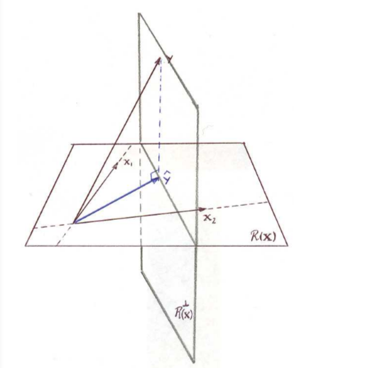

# Econometrics

# OLS
## Basic Equation

$y=\begin{bmatrix}y_1 \\ y_2\\ ..\\ ..\\ y_n\end{bmatrix} and \  \boldsymbol{X}\beta=\begin{bmatrix}x_{11}\beta_1+x_{12}\beta_2+...+x_{1K}\beta_K \\ x_{21}\beta_1+x_{22}\beta_2+...+x_{2K}\beta_K\\.\\.\\.\\ x_{n1}\beta_1+x_{n2}\beta_2+...+x_{nK}\beta_K  \end{bmatrix}$
这里$\boldsymbol{X}\beta$是一个列向量，意为$\boldsymbol{X}$的列变换后得到向量是$y$的投影。OLS的几何意义是将$y$投影到$\boldsymbol{X}$所在的平面上得到$\hat{y}$使$\hat{y},y$之差$\hat{\varepsilon}$的模（即空间中的距离）最小。如下图所示：

$\hat{y}=\boldsymbol{X}\hat{\beta}=X(X^\intercal X)^{-1}X^\intercal y=Py$
$\hat{\varepsilon}=y-\boldsymbol{X}\hat{\beta}=y-X(X^\intercal X)^{-1}X^\intercal y=(I_n-P)y=My$

这里的$P$和$M$分别是对$y$到$R(\boldsymbol{X})$平面和垂直于$R(\boldsymbol{X})$的平面的投影向量

``Claim5 和 Claim6分别说明了P和M的一些重要性质``

## 2.2 Partitioned Regression
若将$\boldsymbol{X}$分为线性不相关(即为互相正交)的两部分$\boldsymbol{X_1}\ und \ \boldsymbol{X_2}$。那么对应的$P_1,P_2$也将起到相同的回归效果，即$P_1+P_2=P$

$y=\boldsymbol{X_1}\beta_1+\boldsymbol{X_2}\beta_2+\varepsilon$

$ P_1y=P_1\boldsymbol{X_1}\beta_1+P_1\boldsymbol{X_2}\beta_2+P_1\varepsilon$

$=P_1\boldsymbol{X_1}\beta_1+X_1(X_1^\intercal X_1)^{-1}X_1^\intercal\boldsymbol{X_2}\beta_2+P_1\varepsilon$

$=P_1\boldsymbol{X_1}\beta_1+P_1\varepsilon$

$so \  \hat{\beta_1}=\left[(P_1X_1)^{\intercal}P_1X_1\right]^{-1}(P_1X_1)^{\intercal}P_1y$

$because P_1X_1=X_1, \hat{\beta_1}=(X_1^{\intercal}X_1)^{-1}X_1^{\intercal}P_1y =$

$(X_1^{\intercal}X_1)^{-1}X_1^{\intercal}X_1(X_1^{\intercal}X_1)^{-1}X_1 y =(X_1^{\intercal}X_1)^{-1}X_1y$

### Frisch-Waugh&Lovell

$y=\boldsymbol{X_1}\beta_1+\boldsymbol{X_2}\beta_2+\varepsilon$

$M_2y=M_2\boldsymbol{X_1}\beta_1+M_2\boldsymbol{X_2}\beta_2+M_2\varepsilon$

$=M_2\boldsymbol{X_1}\beta_1+M_2\varepsilon$

$\hat{\beta_1}=\left[(M_2X_1)^{\intercal}M_2X_1\right]^{-1}(M_2X_1)^{\intercal}M_2y$

$=(X_1^{\intercal}M_2X_1)^{-1}(M_2X_1)^{\intercal}M_2y$

$=(X_1^{\intercal}M_2X_1)^{-1}X_1^{\intercal}M_2y$

$\hat{\beta_2}=(X_2^{\intercal}M_1X_2)^{-1}X_2^{\intercal}M_1y$

通过寻找正交的变量，从而大大减小了计算量

### Frisch-Waugh&Lovell的运用：固定效应面板回归

## 2.3 OLS的性质

Claim 12: $Var(\hat{\beta})=\sigma^2(\boldsymbol{X}^\intercal \boldsymbol{X})^{-1}$

$\hat{\beta}=(\boldsymbol{X}^\intercal \boldsymbol{X})^{-1}\boldsymbol{X}^\intercal (\boldsymbol{X}\beta+\varepsilon)$

$\hat{\beta}-\beta=(\boldsymbol{X}^\intercal \boldsymbol{X})^{-1}\boldsymbol{X}^\intercal \varepsilon$

$E(\hat{\beta}-\beta)=0,E(\hat{\beta})=\beta$

$Var(\hat{\beta})=E((\hat{\beta}-\beta) (\hat{\beta}-\beta)^\intercal)$

$=E(((\boldsymbol{X}^\intercal \boldsymbol{X})^{-1}\boldsymbol{X}^\intercal \varepsilon)((\boldsymbol{X}^\intercal \boldsymbol{X})^{-1}\boldsymbol{X}^\intercal \varepsilon)^{\intercal})$

$=E((\boldsymbol{X}^\intercal \boldsymbol{X})^{-1}\boldsymbol{X}^\intercal \varepsilon\varepsilon^\intercal \boldsymbol{X}(\boldsymbol{X}^\intercal \boldsymbol{X})^{-1})$

$=(\boldsymbol{X}^\intercal \boldsymbol{X})^{-1}\boldsymbol{X}^\intercal \sigma^2 I_n \boldsymbol{X}(\boldsymbol{X}^\intercal \boldsymbol{X})^{-1}$

$=\sigma^2 (\boldsymbol{X}^\intercal \boldsymbol{X})^{-1}$

## BLUE: Best Linear Unbiased Estimator

If $\widetilde{\beta}$ is also an LE of $\beta $,then
$\begin{cases}E(\widetilde{\beta})=0\\ Cy=\widetilde{\beta} \\E(Cy)=E(C(\boldsymbol{X}\beta+\varepsilon))=\beta\\ C\boldsymbol{X}\beta+CE(\varepsilon)=\beta\\ either\  C\boldsymbol{X}\beta=\beta \ or \ C\boldsymbol{X}=I_n\\Var(\widetilde{\beta})=E((C\boldsymbol{X}\beta+C\varepsilon-\beta)(C\boldsymbol{X}\beta+C\varepsilon-\beta)^\intercal)\\=\sigma^2CC^\intercal  \end{cases}$

$Var(\widetilde{\beta})-Var(\hat{\beta})$

$=\sigma^2(CC^\intercal-I_n(\boldsymbol{X}^\intercal \boldsymbol{X})^{-1}{I_n}^\intercal)$

$=\sigma^2(CC^\intercal-C\boldsymbol{X}(\boldsymbol{X}^\intercal \boldsymbol{X})^{-1}\boldsymbol{X}^\intercal C^\intercal)$

$=\sigma^2C(I_n-\boldsymbol{X}(\boldsymbol{X}^\intercal \boldsymbol{X})^{-1}\boldsymbol{X}^\intercal)C^\intercal$

$=\sigma^2C(I_n-P)C^\intercal=\sigma^2CMC^\intercal$

并且因为$M$是半正定的，所以$\sigma^2CMC^\intercal\geq 0$

故$Var(\widetilde{\beta})-Var(\hat{\beta})\geq 0,\hat{\beta}\  is\  the \ BLUE!$

# Econometrics  OLS textbook

### Claim 16
$s^2=(n-k)^{-1} \hat{\epsilon}^\intercal\epsilon$ is the unbiased estimator of $\sigma^2$.And theproof is written on textbook.

$trace(X(X^\intercal X)^{-1})X^\intercal)=trace((X^\intercal X)^{-1})XX^\intercal)=K$ <!--it's on footer lol-->

### Claim 17
gives a way to estimate $\hat{Var}(\hat{\beta})$

### Claim 18
$\hat{\beta}-\beta=(X^\intercal X)^{-1})X\epsilon=A\epsilon\sim N(A\Sigma A^\intercal)$ because $A\epsilon$ is the linear combination of $\epsilon$.

as for $(n-K)\frac{s^2}{\sigma^2}$, from [Green2007](M has to be an idenpotent matrix),we know that it follows the distribution.

for independece, they both follow normal distribution, so linear independence(showed in textbook) totally equals to independence.

## 2.4

$R^2=\frac{ESS}{TSS}=1-\frac{RSS}{TSS}=1-\frac{\hat{\epsilon}^\intercal\epsilon}{y^\intercal M_0y}$ and $M_0=I_n-ll^\intercal/n$ where $ll^\intercal$ is a matrix full of 1, this is the matrix form of deaveraged y.

the adjusted $R^2$ will weaken the effect of adding explaining variables, concentrating on model.

### Information Criterion

SIC and AIC

# OLS test
## 2.4 Constrained Least Squares

Uniside test is more likely to be signifigant Multiside test.

## 2.3.3 J Linear Restrictions (F/Wald Test)
should notice that F is better in small amount samples, with bigger observation, Wald could be as good.
discrepancy: difference

### Wald Test
$H_0:R\beta=c$ then $R(\hat{\beta}-\beta)$~$N(0,R\sigma^2(X^\intercal X)^{-1}R^\intercal)$

$R\hat{\beta}-c\sim N(0,R\sigma^2(X^\intercal X)^{-1}R^\intercal)$

according to [Green2012] $(\sigma^2)^{-1}(R\hat{\beta}-c)^\intercal (R(X^\intercal X)^{-1}R^\intercal)^{-1}(R\hat{\beta}-c)\sim{\chi}^2_{j}$

$(n-K)\frac{s^2}{\sigma^2}\sim \chi^2_{(n-K)}$

so the dividend follows the F-distribution.

## Non-Spherical Disturbances
- (A5**) 
- Example1 : Heteroskedasticity
- Example2 : Serial Correlation
- Example3 : Panel Data with Random Effect