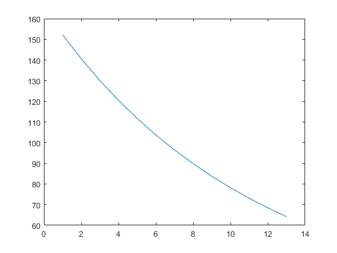

# Assignment1

## 1.
- $P_c(0,3)=\sum_1^{12}\frac{c/4\times 100}{(1+y/4)^{4\times (T_i-0)}}+\frac{100}{(1+y/4)^{4\times (3-0)}}=99.11$
- $P_{FR}(0.5,4)=(P_{FR}(1,4)+c(1))\times Z(0,0.5)=\frac{106.8}{1+6.76\%/2 }=103.31$
- $P_S=P_{noS}+100\times \frac{s}{2}\sum_{0.25}^{6.25}Z(0,t)=\frac{103.2}{1+6.85\%/2}+\sum_1^{13}\frac{0.3/2}{(1+6.85\%/2)^i}=103.15$
  
## 2.
- $P_c=\sum_1^{20}\frac{c/2\times 100}{(1+y/2)^{2*(T_i-t)}}+\frac{100}{(1+y/2)^{2*(T_n-t)}}$ if $y=6.5\%, \; P_c=100.00\; ; if\; u=6\%,\; P_c=103.72,\; ; if\;y=7\%,\;P_c=96.45.$
- the result is the following graph,it looks like a straight line though it's a curve, illustrating that price is most sensitive to rates in this interval  .
  

## 3.
- $Z(0,n)=\frac{P_c-\sum_1^{n-1}Z(0,i/2)\times c/2\times 100}{100+c/2\times 100}$
  $Z(0,0.5)=96.80/100=0.9680$
  $Z(0,1)=\frac{P_c-\sum_1^{1}Z(0,i/2)\times 5.75/2}{100+5.75/2}=0.9407$
  $Z(0,1.5)=\frac{P_c-\sum_1^{2}Z(0,i/2)\times 7.5/2}{100+7.5/2}=0.9032$
  $Z(0,2)=\frac{P_c-\sum_1^{3}Z(0,i/2)\times 7.5/2}{100+7.5/2}=0.8740$
- 1. $P_{c1}=4\times Z(0,0.5)+104\times Z(0,1)=101.71$
  $P_{c2}=6.235\times Z(0,0.5)+106.235\times Z(0,1)=105.97$. Not the same.

  1. I think there is no arbitrage opportunity because these two bonds are in different periods. So one can not hold 0 position. If they are in the same period, then buy long bond1 and short bond2, say hold long position of 105.97/101.71 units of bond1 and short position of 1 unit bond2. The total cash flow will be $107-102.13\times105.97/101.71=0.5924$ and  satisfies all the elements of arbitrage.

## 4.
- for porttfolio A: 
  $D_{pA1}=3.8197;\;D_{pA2}=6.3957;\;D_{pA3}=0.2540;\;D_{pA4}=1;D_{pA5}=1.9463;\;D_{pA}=3.3749$
  for portfolio B:
  $D_{pB1}=5.4117;\;D_{pB2}=3.9836;\;D_{pB3}=0.25;\;D_{pB4}=0.5;\;D_{pB5}=1.4565;\;D_{pB}=3.3334$
- invest \$100million, $D_p^\$=P\times D_p $ so $D_{pA}^\$=\$337.49million;\;D_{pB}^\$=\$333.34million.$
- $PV01_A=-D_{pA}^\$\times0.01\%=\$33,749;\;$
  $PV01_B=-D_{pB}^\$\times0.01\%=\$33,334.\;$
- Portfolio B is less risky and more adequate for risk-averse investor. If one is rather  risk-loving, maybe he should try other assets.

            

                
            

            

                杜瑞琛  
                2019100505 
                drcuibe@163.com
            

        
