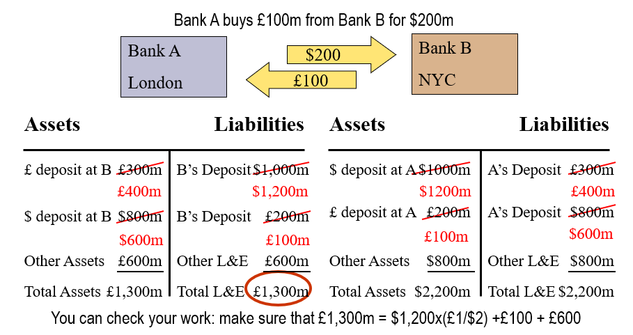
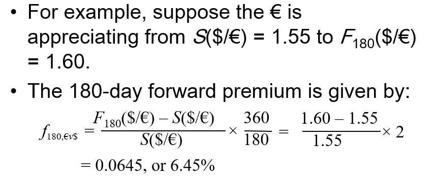

 
# 
International Finance 

## Spot FX market

### Corresponding Banking Relationships

direct exchange rate(based on RMB ,china): ￥7/$1

indirecr ex rate: $0.14/￥1

bid price is a dearler's willing to pay price;
ask(offer) is a what you should pay for foreign exchange of dealer;
$bid<ask$

 The FX market, stakes are high, and term is short, very risky.

 From an academic view, insider dealing is beneficial for market efficiency. For it suggests the hidden information in price immediately.

## Cross Rates with Bid-Ask Spread
 Bidder pays bid, and get ask, he is always the winner.
 And if banks have different quotations of FX, then there can be a triangular arbitrage.(use your position to seek for imbalanced price)

## Foward FX market

quotations of banks 1,3,6,9,12 months maturity.

Arbitraged FX Rate Spread with Forward and Spot is caused by interest rate spread. Currency with higher interest rate is about going to depreciate(-).

### Equilibrium View
We should focus on balance of FX market. if currency A is going to depreciate against B. To guard A, interest should rise to make A more attractive.

  
## Swaps
 a swap is an agreement to provide a counterparty with something he or she wants in exchange for something that you want.(often recurring).

 swap counts $ 56\% $ of interbank FX transactions.

 #  future and options in International Finance

$Strike\  price=E $ is based on contract
$S_T=current \ \ price$
premium: option is right with cost
Intrinsic value:
$call: =MAX(S_T-E,0)$
$put: =MAX(E-S_T,0)$
$option$ $value$$=$$intrinsic\ \ value\  + speculative(time)\ \  value$
time value fades as time passed

$C=\frac{S_0-\frac{S_{1-}}{1+R_f}}{2}$

$\Delta = \frac{C^{up}-C^{down}}  {S^{up}-S^{down}}$

## BackDating
to make the option in the money, stock holders (board) will decide to "backdate" their meeting, to trace back the strike price at a low level; 
 