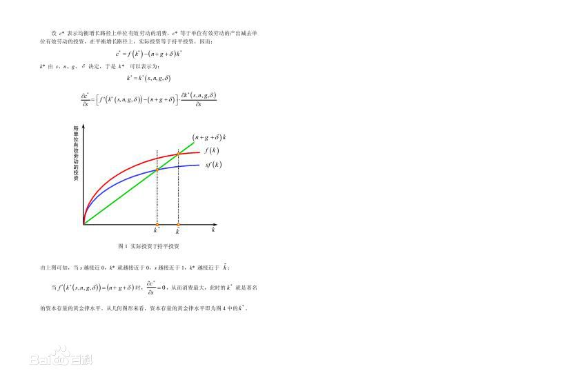

<script type="text/javascript"
       src="http://cdn.mathjax.org/mathjax/latest/MathJax.js?config=TeX-AMS-MML_HTMLorMML"></script>

<style>
*{
    font-family:'Segoe UI';
}
</style>
# Macro Economics Ch1
## Solow Growth Model
2 perspectives$\begin{cases}
    time \ \ series\\
    cross \ \ sectional
\end{cases}$
    

### Assumption:
 $Y_t=F(K_t,A_tL_t)$ (production function) 
$A_t$ is ```Knowledge``` as well as ```effectiveness of labor```
$A_tL_t$ is ```effective labor```
### Aside:
$Y=F(KL)$: ```labor arrangement``` or ```harrod neutral``` 
$Y=F(AK,L)$:```capital arrangement```
$Y=AF(K,L)$:```Hicks neutral```
$Y=F(K,A,L)$
### Constant return to scale

$F(cK,cAL)=cF(K,AL)$

```more realistic for large economy```
$\frac{1}{AL}F(K,AL)=F(\frac{K}{AL},1)$
define $k=\frac{K}{AL}$,```capital per unit ofeffective labor```
$y=\frac{Y}{AL}=F(k,1)=f(k)$ ```return per ...```

### Assumption on f

$f(0)=0,\ f(k)^\prime>0,\ f(k)^{\prime\prime}<0$

### Exercise:

prove that $\frac{\partial F(K,AL)}{\partial K}=f\prime(k)$

### More restrictions on f(k)

Inada Condition: 
$\lim\limits_{k \to \infty}f\prime(k)=0,\lim\limits_{k \to0}f\prime(k)=\infty$
### Cobb-Douglas function

$F(K,AL)=K^\alpha (AL)^{1-\alpha}$

## Exogenous Growth rate of labor & knowledge

$\dot{L}(t)=nL(t),\dot{A}(t)=gA(t)$
for $\dot{F}(t)=\frac{\partial F(t)}{\partial t}$

```!!!!!```$\frac{\dot{A(t)L(t)}}{A(t)L(t)}=g+n$```!!!!!```


## Exogenous saving rate s saving rate s is constant across time(strong assumption)

```Exogenous is strong because it simplized the model```
```constant across time is strong for similar reason```

capital depreciation rate $\delta>0$
dynamics of capital: $\dot{K_t}=sY_t-\delta K_{t}$

### investigate of dynamics of  $\dot{k_t}$
$\dot{k_t}=\frac{\partial k(t)}{\partial t}=\frac{\partial\frac{K(t)}{AL(t)}}{\partial t}=\frac{AL(t)\dot{K}(t)-K(t)AL\prime(t)}{AL^2(t)}=\frac{\dot{K(t)}}{AL(t)}-\frac{(g+n)K(t)}{AL(t)}=sy(t)-\delta k(t)-(g+n)k(t)$

$=sy(t)-(g+n+\delta)k(t) $
first part is called extra investment
the second part is called break even investment 


### phase diagram for solow model

## Balanced Growth Path

$K,Y,Y/K,Y/L,K/L$
$\underline{K}=AL(t)k^*(t)$
$\underline{Y}=AL(t)y^*(t)$
$\underline{Y}/K=y^*/k^*$
$\underline{Y}/L=A(t)y^* \to g$
$\underline{K}/L=A(t)k^* \to g$ ```!!!!!!!!!!!!!!!```
 
so it's clear that capital accumulation can't result in sustainable growth. what's important is g&n. just ```level effect``` no ```growth effect```

### Balanced growth path


### Exercise graph for $\ln(\underline{Y}/L)$

### Conclusion: 
```a change in saving rate has a level effect but not a growth effect```

### the impact on consumption c
if raise saving rate s. how's c going?
$c^*=(1-s)f(k^*)$
if there is any s that maximize the consuming level?
$\frac{\partial{c}}{\partial{s}}=\frac{\partial{f(k)-(n+g+\delta)k}}{\partial s}=(f\prime(k)-(n+g+\delta))\times k\prime$
so best level of s is to make $f(k^*)\prime=(n+g+\delta)$
this k* is call $k_{gr}$ ```golden rule capital stock```
<div style="width:2000px"></div>
<div style="width:1800px"></div>

### quantitative implications
$\frac{\partial y^*}{\partial s}=f\prime(k^*)\frac{\partial k^*}{\partial s}$
$sf(k^*)=(n+g+\delta)k^*=>f(k^*)+sf\prime(k^*)\frac{\partial k^*}{\partial s}=(n+g+\delta)\frac{\partial y^*}{\partial s}$

elasticity analyse
$\frac{\partial y^*}{\partial s}\frac{s}{y}=\frac{s}{f(k^*)}\frac{f\prime(k^*)f(k^*)}{(n+g+\delta)-sf\prime(k^*)}$


$=\frac{(n+g+\delta)k^*f\prime(k^*)}{(n+g+\delta)f(k^*)-sf\prime(k^*)f(k^*)}=\frac{k^*f\prime(k^*)}{f(k^*)-k^*f\prime(k^*)}$

$\frac{f\prime(k)k}{1-kf\prime(k)}=\frac{\partial y/y}{\partial s/s}=\frac{\alpha_k}{1-\alpha_k}$

$\alpha_k=\frac{f\prime(k)k}{f(k)}$```share of capital``` in most developed regions, $\alpha_k=\frac{1}{3}$

The speed of convergence [How rapidly do the effects occur]
$\dot{k}(k)=sf(k)-\delta k-(g+n)k$
taylor expand it and 
$\dot{k}(k)=\frac{\partial \dot{k}(k^*)}{\partial{k}}(k-k^*)$
define $\lambda=-\frac{\partial \dot{k}(k^*)}{\partial{k}}=> \dot{k}=-\lambda(k-k^*)=>k(t)=k^*+e^{-\lambda}[k(0)-k^*]$
$\lambda=(n+g+\delta)-sf\prime(k^*)=(n+g+\delta)-\frac{sf(k^*)}{f(k^*)}f\prime(k^*)=(n+g+\delta)-\frac{(n+g+\delta)k^*f\prime(k^*)}{f(k^*)}=(n+g+\delta)(1-\alpha_k)$
$n:1\%-2\%;\;g:1\%-2\%;\;\delta:3\%-4\%;\;\alpha_k=\frac{1}{3};\;(n+g+\delta):6\%,=>\lambda=0.04$
0.04 is the speed that $y_0^*$ goes to $y_1^*$.

## Chapter2 : Infinite-Horizon and Overlapping-Generation model

A key feature: saving rate is endogenously determined by households.

### The Ramsey-Cass-Koopmans Model

Assumptions: Firms, a large number of firms.
$\underline{Y}=F(K,AL)$ constant return to scale.Firms have workers rent capital in competitive factor markets. As well as g are taken as given. Firms maximize profit and they are owned by households.
Households,a large number of identical households, the size of each grows at a rate $\underline{n}$. Each member of them supplies 1 unit of labor at every point in time. The households rent whatever capital it owns to firms. Initial capital holding $\frac{K(0)}{H}$ and H is member of households.

The households' utility function
$argmax U=\int^\infin_0 e^{-\rho t} u(c_t)\frac{K(0)}{H}dt$.
$u(C_t)$ instaneous utility function
$L(t)$  Total labor at t
$\rho$ subjective utility discount rate.
$u(c(t))=\frac{C(t)^{1-\theta}}{1-\theta},\rho>0,\rho-n-(1-\theta)g>0$
Constant relative risk aversion utility.
relative risk aversion:$-\frac{c(u\prime\prime(c))}{u\prime(c)}$
 1. $lim u^*(c_t)$ redifine $u^*(c_t)=\frac{c_t^{1-\theta}}{1-\theta}=ln(c(t+1))$ 
 2. $\rho-n-(1-\theta)g=>utility\; does\; not \; diverse$

Firms : how much capital und labor to employ 
Pay marginal profits to labor und capital.
constant return to scale&competitive market=>zero profit.
$\underline{Y}=F(K,AL)$
Marginal product of K $\frac{\partial F(K,AL)}{\partial K}=\frac{\partial AL f(k)}{\partial K}=f\prime(k)$
Marginal product of L $\frac{\partial F(K,AL)}{\partial L}=\frac{\partial AL f(k)}{\partial L}=Af(k)+ALf\prime(k)(-\frac{K}{AL^2})=A[f(k)-kf\prime(k)]$
Competitive factor market 
1. real interest rate:$r(t)=f\prime(k(t))$
2. real wage: $W(t)=A_t[f(k_t)-k_tf\prime(k_t)]$
3. real wage per unit of effective labor:$w(t)=f(k)-kf\prime(k)$
- Households' budget constraint:
    Take the path of $r(t)\; und\; W(t)$ are given, present value of consumption $\leq$ initial wealth + PV of labor.
    Define $R(t)=\int_0^t r(t)dt\;$ continuous compounding interest rate.
- PV of consumption: 
  $\int_0^\infin e^{-R(t)}C(t)\frac{L(t)}{H}dt$
- PV of labor incomes: 
    $\int_0^\infin e^{-R(t)}W(t)\frac{L(t)}{H}dt$
- Budget Constraint:
    $\int_0^\infin e^{-R(t)}C(t)\frac{L(t)}{H}dt\leq\frac{K(0)}{H}+\int_0^\infin e^{-R(t)}W(t)\frac{L(t)}{H}dt$
  - transform to: $\lim_{t\to\infin}[\frac{K(0)}{H}+\int_0^\infin e^{-R(t)}(W(t)-C(t))\frac{L(t)}{H}dt]\geq0$

- Households' capital holding at time S
  $\frac{K(S)}{H}=e^{R(s)}\frac{K(0)}{H}+\int_0^\infin e^{-R(t)}(W(t)-C(t))\frac{L(t)}{H}dt$
  $\lim_{t \to \infin} e^{R(s)}\frac{K(S)}{H}\geq 0$=>No Ponzi Condition.
- Households' maximization Problem.
    Define $c(t)=\frac{C(t)}{A(t)},\;A(t)=A(0)\times e^{gt}$
    Rewrite $u(c_t)=\frac{C(t)^{1-\theta}}{1-\theta}=\frac{[A(t)c(t)]^{1-\theta}}{1-\theta}=\frac{[A(0)e^{gt}]^{1-\theta}}{1-\theta}c(t)^{1-\theta}$
    $U=B\int e^{\beta t }\frac{C(t)^{1-\theta}}{1-\theta}dt$
    $B\equiv A(0)^{1-\theta}\frac{L(0)}{H},\;\beta\equiv\rho-n-(1-\theta)g$
-  using the fact that
    - $C(t)=A(t)c(t)$
    - $K(0)=k(0)A(0)L(0)$
    - $W(t)=A(t)w(t)$
- to Rewrite BC:
  $\int e^{-R(t)}c(t)e^{(n+g)t}dt\leq k(0)+\int e^{-k(t)}w(t)e^{(n+g)t}dt$
  Max U subject to BC
  - Lagrangian $L=B\int e^{-\beta t}\frac{c(t)^{1-\theta}}{1-\theta}dt+\lambda [{ k(0)+\int e^{-R(t)+(n+g)t}(w(t)-c(t))dt}]$
  - FOC with respect to $c_t$
    $Be^{-\beta t}c(t)^{-\theta}=\lambda e^{-R(t)}e^{(n+g)t}$
   - $lnB-\beta t-\theta ln c(t) =ln\lambda -R(t)+(n+g)\times t,\;R(t)=\int r(t)dt$ 
   - differentiating with with respect to
    $-\beta -\theta\frac{\dot{c}(t)}{c(t)}=-r(t)+(n+g)$
    - $\frac{\dot{c}(t)}{c(t)}=\frac{r(t)-n-g-\beta}{\theta}=\frac{r(t)-\rho-\theta g}{\theta}$ ```Euler Equation!```
    - $t=0 -> c(0)$ can be solved,$c(t)=f(c(t))$
    - $\frac{\dot{C}(t)}{C(t)}=\frac{\dot{c}(t)}{c(t)}+\frac{\dot{A}(t)}{A(t)}=\frac{r(t)-\rho-\theta g}{\theta}+g=\frac{r(t)-\rho}{\theta}$

 -  Intuition behind Euler equation
     If the household is optimizing it's consumption path, ```utility loss at t=utility gain at t+dt```. 