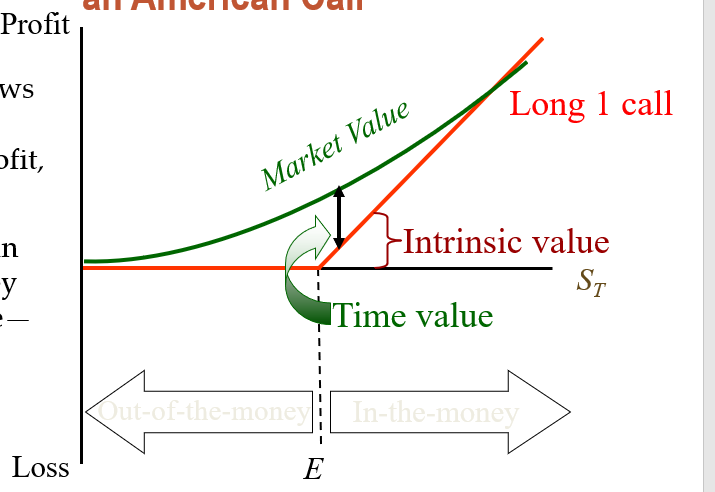

#  future and options in International Finance
<style>
*{
    
    font-size:25px
}
</style>
$Strike\  price=E $ is based on contract
$S_T=current \ \ price$
premium: option is right with cost
Intrinsic value:
$call: =MAX(S_T-E,0)$
$put: =MAX(E-S_T,0)$
$option$ $value$$=$$intrinsic\ \ value\  + speculative(time)\ \  value$
time value fades as time passed


$C=\frac{S_0-\frac{S_{1-}}{1+R_f}}{2}$

$\Delta = \frac{C^{up}-C^{down}}  {S^{up}-S^{down}}$

## BackDating
to make the option in the money, stock holders (board) will decide to "backdate" their meeting, to trace back the strike price at a low level;
```git 2nd res commit```